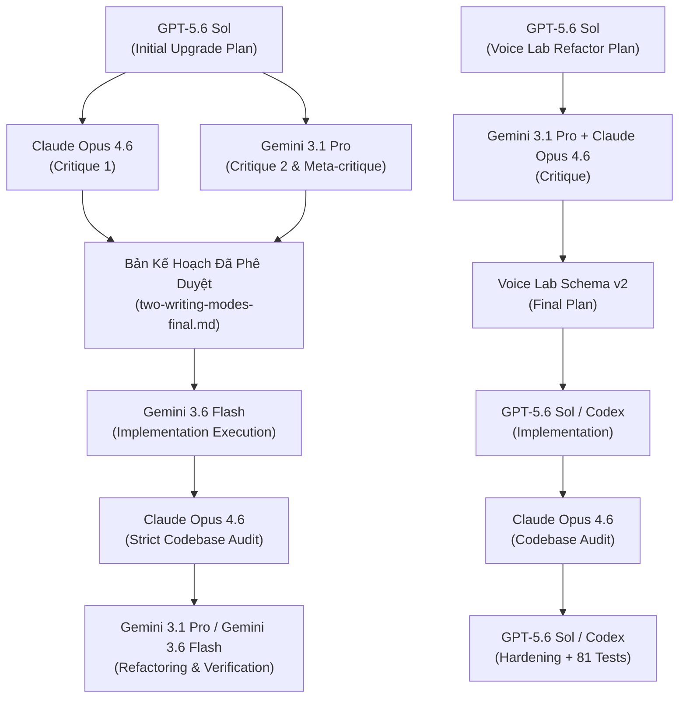

# Nhật Ký Hoạt Động Của Đại Lý (Agent Activities Log)

> **Tham chiếu kế hoạch phê duyệt:**
> - [docs/2026-07-22-mindful_writing_os-two-writing-modes-final.md](file:///D:/Nghi%C3%AAn%20c%E1%BB%A9u%20AI/write_blog/docs/2026-07-22-mindful_writing_os-two-writing-modes-final.md)
> - [docs/2026-07-27-voice-lab-refactor-plan-final.md](file:///D:/Nghi%C3%AAn%20c%E1%BB%A9u%20AI/write_blog/docs/2026-07-27-voice-lab-refactor-plan-final.md)
>
> **Cập nhật:** 2026-07-28
> **Dự án:** Mindful Writing OS - Dual Writing Modes & Voice Lab Schema v2

---

## 1. Tổng Quan Phân Vai Multi-Agent trong Dự Án

Trong đợt nâng cấp toàn diện hệ thống thành **Hệ Hai Writing Modes**, nhiều Agentic AI khác nhau đã tham gia phối hợp theo quy trình đa đại lý (Multi-Agent Collaboration) chặt chẽ:

---

## 2. Chi Tiết Hoạt Động Của Từng Agent

### 2.1. GPT-5.6 Sol (Kiến Trúc Sư Kế Hoạch Ban Đầu)
- **Nhiệm vụ:** Thiết lập bản kế hoạch nâng cấp hệ thống `mindful_writing_os` thành Hệ Hai Writing Modes (`deep_blog_mode` và `moment_blog_mode`).
- **Sản phẩm:** [docs/2026-07-22-mindful_writing_os-two-writing-modes-plan.md](file:///D:/Nghi%C3%AAn%20c%E1%BB%A9u%20AI/write_blog/docs/2026-07-22-mindful_writing_os-two-writing-modes-plan.md).
- **Đóng góp chính:**
  - Định nghĩa 6 Agent chuyên biệt cho `moment_blog_mode`: `sensory_capture`, `inner_weather`, `cosmic_signal_reader`, `moment_writer`, `breath_editor`, `gentle_witness`.
  - Phân định nguyên tắc bài viết ngắn (300-600 từ), hiện tại, trực giác, không ép bài học.

### 2.2. Claude Opus 4.6 (Phản Biện Kế Hoạch & Audit Mã Nguồn)
- **Nhiệm vụ:** 
  1. Đóng góp ý kiến phản biện độc lập cho bản kế hoạch của Sol.
  2. Thực hiện Đánh giá / Audit nghiêm ngặt đối với mã nguồn do Gemini 3.6 Flash triển khai.
- **Sản phẩm:** 
  - Artifact phản biện kế hoạch.
  - Báo cáo Audit chi tiết: `audit_report.md`.
- **Đóng góp chính:**
  - Phát hiện 5 điểm sai lệch/sót hợp đồng (Flow duplicate, thiếu token limits cho Moment Mode, hardcoded flow whitelist, explicit_mode parsing bằng sys.argv, và mâu thuẫn schema skill YAML).
  - Đề xuất 5 Vector Refactor cụ thể kèm đoạn code sửa lỗi ngắn gọn (5-7 dòng).

### 2.3. Gemini 3.1 Pro (Phản Biện Độc Lập & Khắc Phục Triệt Để)
- **Nhiệm vụ:**
  1. Phản biện lại các luận điểm của Claude Opus 4.6, tổng hợp thành phản biện hai chiều thống nhất.
  2. Cập nhật nội dung phản biện vào tài liệu kế hoạch.
  3. Đảm nhận nhiệm vụ nâng cấp & khắc phục toàn bộ 5 Vector Refactor từ báo cáo Audit dưới chế độ `/goal`.
- **Sản phẩm:**
  - Bản kế hoạch chính thức được duyệt: [docs/2026-07-22-mindful_writing_os-two-writing-modes-final.md](file:///D:/Nghi%C3%AAn%20c%E1%BB%A9u%20AI/write_blog/docs/2026-07-22-mindful_writing_os-two-writing-modes-final.md).
  - Tinh chỉnh `engine/workflow.py`, `engine/run_workflow.py`, `engine/learning.py`, `engine/config.example.yaml`, xóa `write_deep_blog.yaml`.
  - Chuẩn hóa 6 Skill YAML của Moment Mode và bổ sung unit tests.

### 2.4. Gemini 3.6 Flash (Thực Thi Lập Trình Ban Đầu)
- **Nhiệm vụ:** Hiện thực hóa bản kế hoạch đã duyệt dưới lệnh `/goal`.
- **Đóng góp chính:**
  - Khởi tạo 6 skill YAML mới trong thư mục `skills/moment/reflective/`.
  - Khởi tạo `flow/write_moment_blog.yaml`.
  - Thêm cờ `--mode` vào CLI `engine/run_workflow.py` và hỗ trợ phân tách thư mục `learning/<mode>/<timestamp>/`.
  - Viết bộ unit test ban đầu `tests/test_moment_blog_mode.py`.

### 2.5. Subagents Chuyên Biệt (Guided Style Voice Lab Core Team)
Trong đợt nâng cấp **Guided Style Voice Lab V1 (2026-07-26)**, 4 Subagent chuyên biệt đã được khởi tạo để hiện thực hóa 4 phân vùng kiến trúc:
1. **Data & Security Architect Subagent (`065c2c93`)**:
   - **Xây dựng:** `engine/voice_lab/models.py`, `migration.py`, `archive.py`.
   - **Đóng góp V1:** Định nghĩa Pydantic Schemas (`StyleProfile`, `VoiceDNA`, `EvidenceClaim`, `CanonicalIR`), `sanitize_sample`, nạp style cũ và archive SHA-256. Trong schema v2, `sanitize_sample` đã bị xóa để bảo toàn exact quote; sample được JSON-serialize và validate thay thế.
2. **Backend Domain Engineer Subagent (`0b671dfc`)**:
   - **Xây dựng:** `engine/voice_lab/analyzer.py`, `interview.py`, `compiler.py`, `overrides.py`.
   - **Đóng góp:** Phân tích Voice DNA & Bằng chứng (100% tiếng Việt), tạo phỏng vấn & A/B Calibration mù (`calibrate_ab`, `DIMENSION_VI`), lập ma trận kề `DIMENSION_AGENTS` và bộ xử lý 3-way diff overrides.
3. **UI/UX Integrator Subagent (`c6144baa`)**:
   - **Xây dựng:** Giao diện 5-Step Guided Voice Lab Wizard trong `ui/app.py`.
   - **Đóng góp:** Tích hợp Quota Estimator UI, Layer Inspector so sánh Canonical IR và Effective YAML, cùng quy trình xuất bản an toàn 4 tầng Publish Safety Pipeline (Staging -> Validate -> Backup -> Atomic Replace / Rollback).
4. **QA & Verification Bot Subagent (`2b3d3fbe`)**:
   - **Xây dựng:** `tests/test_voice_lab.py`.
   - **Đóng góp:** Viết bộ Contract Test kiểm chứng 100% độ phủ ma trận kề `DIMENSION_AGENTS` và Zero-cost Smoke Test kiểm tra từ khóa không tốn Quota.

### 2.6. Agent Chính (Antigravity Main Agent)
- **Nhiệm vụ:** Điều phối toàn hệ thống, sửa lỗi Publish Staging (`AGENT_FILENAME_MAP`), Việt hóa 100% phỏng vấn & calibration, đóng vai trò Bridge Agent chạy workflow Moment mode với style `va-natural` qua Local Model Quota.

### 2.7. GPT-5.6 Sol / Codex Main Agent (Voice Lab Schema v2)

- **Nhiệm vụ:**
  1. Audit logic và prompt Voice Lab hiện hữu.
  2. Lập, phản biện và hợp nhất kế hoạch refactor với ý kiến Gemini 3.1 Pro và Claude Opus 4.6.
  3. Triển khai toàn bộ schema v2, Gemini analysis pipeline, compiler/publisher và UI adapter.
  4. Thực thi vòng hậu kiểm Claude Opus 4.6 và bổ sung regression.
- **Sản phẩm chính:**
  - `docs/2026-07-27-voice-lab-refactor-plan-final.md`.
  - `engine/voice_lab/prompts.py`, `parser.py`, `publisher.py`.
  - Refactor `models.py`, `analyzer.py`, `interview.py`, `compiler.py`, `overrides.py`, `migration.py`, `archive.py`.
  - Nối lại wizard trong `ui/app.py` và mở rộng `tests/test_voice_lab.py`.
- **Nguyên tắc triển khai:**
  - Voice Lab chỉ gọi Gemini API; không dùng OpenAI hoặc Antigravity Bridge.
  - Không tạo fallback DNA/evidence/A-B giả.
  - Không dùng subagent trong vòng triển khai schema v2; code được sửa và audit tuần tự trên cùng worktree để tránh xung đột với thay đổi người dùng.
- **Kết quả:** 81/81 regression test pass, gồm 37 test Voice Lab; Streamlit AppTest 0 exception.

### 2.8. GPT-5.6 Sol / Codex Main Agent (P1 Hardening)

- Triển khai tuần tự P1.1–P1.4, mỗi mục có checkpoint riêng.
- Bổ sung UI acceptance và visual verification; sửa state style chéo mode.
- Siết parser envelope và đồng bộ model telemetry Gemini với request thực tế.
- Transaction hóa validation toàn style và uniqueness của alias.
- Tách migration v1 khỏi runtime schema v2 fail-closed.
- Không dùng subagent; không gọi API thật; không chạm dữ liệu run/style của người dùng.
- **Kết quả:** 120/120 test pass, 4 parser subtest pass; `runs/` giữ nguyên.

---

## 3. Nhật Ký Tiến Trình Triển Khai (Execution Timeline)

| Thời gian | Agent | Thao tác chính | Kết quả |
| :--- | :--- | :--- | :--- |
| 2026-07-22 06:40 | GPT-5.6 Sol | Lập kế hoạch nâng cấp 2 Writing Modes | Tạo file `2026-07-22-mindful_writing_os-two-writing-modes-plan.md` |
| 2026-07-22 06:47 | Claude Opus 4.6 | Phản biện kế hoạch | Xuất artifact phản biện |
| 2026-07-22 06:54 | Gemini 3.1 Pro | Phản biện độc lập & chốt kế hoạch final | Xuất `2026-07-22-mindful_writing_os-two-writing-modes-final.md` |
| 2026-07-22 15:26 | Gemini 3.6 Flash | Triển khai mã nguồn toàn bộ 2 modes (`/goal`) | Xây dựng skills, flows, engine & test suite (33 tests OK) |
| 2026-07-22 15:31 | Claude Opus 4.6 | Audit mã nguồn cực kỳ cô đọng | Xuất báo cáo audit với 5 vector refactor |
| 2026-07-22 15:38 | Gemini 3.1 Pro | Khắc phục triệt để các lỗi Audit (`/goal`) | Xóa file trùng, chuẩn hóa YAML, sửa CLI, 34/34 tests OK |
| 2026-07-25 10:15 | Antigravity Agent | Triển khai Multi-Editable-Style V5.0 | Xây dựng `style_manager.py`, UI 4 Tabs, Group-Based Validator |
| 2026-07-26 11:30 | Subagents 1-4 | Triển khai Voice Lab V1 Backend & UI | Tạo gói `engine/voice_lab/`, `tests/test_voice_lab.py`, UI 5-step |
| 2026-07-26 14:15 | Antigravity Agent | Khắc phục lỗi Publish Rollback & Việt hóa | Thêm `AGENT_FILENAME_MAP`, Việt hóa `analyzer.py` & `interview.py` |
| 2026-07-26 14:48 | Antigravity Agent | Chạy Moment Blog `va-natural` qua Local Quota | Tạo bài blog khoảnh khắc `Người Vô Sự` hoàn chỉnh |
| 2026-07-26 15:07 | Antigravity Agent | Cập nhật hệ thống tài liệu `docs/` (`/goal`) | Hoàn tất cập nhật 5 file tài liệu kiến trúc & lịch sử |
| 2026-07-27 | GPT-5.6 Sol | Audit, lập kế hoạch và hợp nhất phản biện Voice Lab | Chốt `2026-07-27-voice-lab-refactor-plan-final.md` |
| 2026-07-27 | GPT-5.6 Sol | Triển khai Voice Lab schema v2 | Structured Gemini pipeline, full-template compiler, archive/publisher v2, UI adapter |
| 2026-07-27 | Claude Opus 4.6 | Audit implementation Voice Lab v2 | Xác nhận phần lớn contract; đề xuất các vector tinh chỉnh |
| 2026-07-27 | GPT-5.6 Sol | Thực thi audit recommendations và regression | 81/81 test pass; 37 test Voice Lab; UI 0 exception |
| 2026-07-28 | GPT-5.6 Sol | Triển khai P1.1–P1.4 theo checkpoint | UI acceptance, parser/model telemetry, style transaction, migration fail-closed; 120/120 test pass |

---

## 4. Bài Học Kinh Nghiệm Quản Trị Đa Đại Lý (Multi-Agent Governance)

1. **Khóa Contract Trước Khi Viết Code (Phase 0):** Việc chốt rõ Schema giữa `output.artifact` và `output.handoff` giúp tránh bất kỳ sự sai lệch nào giữa các sub-agents.
2. **Khớp Tên File Hợp Đồng (Filename Mapping):** Khi biên dịch code động ra thư mục staging, luôn phải dùng bảng tra cứu tên file cứng (`AGENT_FILENAME_MAP`) để đảm bảo không bị lỗi vi phạm hợp đồng Flow do lệch slug.
3. **Quy Trình Xuất Bản An Toàn Nguyên Tử (Atomic Replace & Rollback):** Việc áp dụng staging -> validate -> replace giúp bảo vệ tuyệt đối dữ liệu phong cách hệ thống không bị hư hỏng khi gặp sự cố giữa chừng.
4. **Phân Tách Thư Mục Tri Thức Theo Mode:** Việc phân chia tri thức học được (`learning/deep/` và `learning/moment/`) giúp bảo vệ phong cách bài viết ngắn không bị pha tạp bởi các quy tắc biên tập của bài viết dài.
5. **Evidence Trước Kết Luận:** Quote phải khớp nguyên văn; evidence sai được reject để audit thay vì âm thầm sửa hoặc bịa profile.
6. **Một Nguồn Contract:** Canonical IR giữ `effective_skill` đầy đủ; không duy trì đồng thời các bản `prompt`/`style_rules` phẳng dễ lệch pha.
7. **Provider Boundary Rõ Ràng:** Voice Lab dùng Gemini trực tiếp; router OpenAI/Antigravity thuộc workflow khác và không bị kéo vào module phân tích giọng văn.
8. **Audit Phải Có Regression:** Mỗi khuyến nghị được khóa bằng test cụ thể, sau đó chạy toàn bộ regression và UI smoke test.
