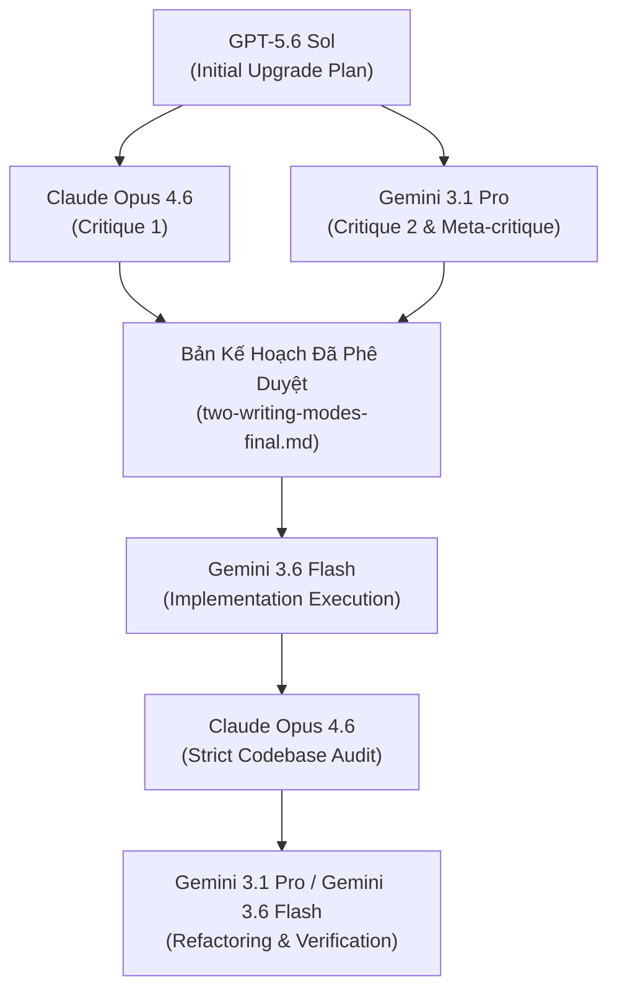

# Nhật Ký Hoạt Động Của Đại Lý (Agent Activities Log)

> **Tham chiếu kế hoạch phê duyệt:** [docs/2026-07-22-mindful_writing_os-two-writing-modes-final.md](file:///D:/Nghi%C3%AAn%20c%E1%BB%A9u%20AI/write_blog/docs/2026-07-22-mindful_writing_os-two-writing-modes-final.md)  
> **Ngày thực hiện:** 2026-07-22  
> **Dự án:** Mindful Writing OS - Dual Writing Modes Upgrade

---

## 1. Tổng Quan Phân Vai Multi-Agent trong Dự Án

Trong đợt nâng cấp toàn diện hệ thống thành **Hệ Hai Writing Modes**, nhiều Agentic AI khác nhau đã tham gia phối hợp theo quy trình đa đại lý (Multi-Agent Collaboration) chặt chẽ:

---

## 2. Chi Tiết Hoạt Động Của Từng Agent

### 2.1. GPT-5.6 Sol (Kiến Trúc Sư Kế Hoạch Ban Đầu)
- **Nhiệm vụ:** Thiết lập bản kế hoạch nâng cấp hệ thống `mindful_writing_os` thành Hệ Hai Writing Modes (`deep_blog_mode` và `moment_blog_mode`).
- **Sản phẩm:** [docs/2026-07-22-mindful_writing_os-two-writing-modes-plan.md](file:///D:/Nghi%C3%AAn%20c%E1%BB%A9u%20AI/write_blog/docs/2026-07-22-mindful_writing_os-two-writing-modes-plan.md).
- **Đóng góp chính:**
  - Định nghĩa 6 Agent chuyên biệt cho `moment_blog_mode`: `sensory_capture`, `inner_weather`, `cosmic_signal_reader`, `moment_writer`, `breath_editor`, `gentle_witness`.
  - Phân định nguyên tắc bài viết ngắn (300-600 từ), hiện tại, trực giác, không ép bài học.

### 2.2. Claude Opus 4.6 (Phản Biện Kế Hoạch & Audit Mã Nguồn)
- **Nhiệm vụ:** 
  1. Đóng góp ý kiến phản biện độc lập cho bản kế hoạch của Sol.
  2. Thực hiện Đánh giá / Audit nghiêm ngặt đối với mã nguồn do Gemini 3.6 Flash triển khai.
- **Sản phẩm:** 
  - Artifact phản biện kế hoạch.
  - Báo cáo Audit chi tiết: `audit_report.md`.
- **Đóng góp chính:**
  - Phát hiện 5 điểm sai lệch/sót hợp đồng (Flow duplicate, thiếu token limits cho Moment Mode, hardcoded flow whitelist, explicit_mode parsing bằng sys.argv, và mâu thuẫn schema skill YAML).
  - Đề xuất 5 Vector Refactor cụ thể kèm đoạn code sửa lỗi ngắn gọn (5-7 dòng).

### 2.3. Gemini 3.1 Pro (Phản Biện Độc Lập & Khắc Phục Triệt Để)
- **Nhiệm vụ:**
  1. Phản biện lại các luận điểm của Claude Opus 4.6, tổng hợp thành phản biện hai chiều thống nhất.
  2. Cập nhật nội dung phản biện vào tài liệu kế hoạch.
  3. Đảm nhận nhiệm vụ nâng cấp & khắc phục toàn bộ 5 Vector Refactor từ báo cáo Audit dưới chế độ `/goal`.
- **Sản phẩm:**
  - Bản kế hoạch chính thức được duyệt: [docs/2026-07-22-mindful_writing_os-two-writing-modes-final.md](file:///D:/Nghi%C3%AAn%20c%E1%BB%A9u%20AI/write_blog/docs/2026-07-22-mindful_writing_os-two-writing-modes-final.md).
  - Tinh chỉnh `engine/workflow.py`, `engine/run_workflow.py`, `engine/learning.py`, `engine/config.example.yaml`, xóa `write_deep_blog.yaml`.
  - Chuẩn hóa 6 Skill YAML của Moment Mode và bổ sung unit tests.

### 2.4. Gemini 3.6 Flash (Thực Thi Lập Trình Ban Đầu)
- **Nhiệm vụ:** Hiện thực hóa bản kế hoạch đã duyệt dưới lệnh `/goal`.
- **Đóng góp chính:**
  - Khởi tạo 6 skill YAML mới trong thư mục `skills/moment/reflective/`.
  - Khởi tạo `flow/write_moment_blog.yaml`.
  - Thêm cờ `--mode` vào CLI `engine/run_workflow.py` và hỗ trợ phân tách thư mục `learning/<mode>/<timestamp>/`.
  - Viết bộ unit test ban đầu `tests/test_moment_blog_mode.py`.

### 2.5. Subagents Chuyên Biệt (Research & Codebase Auditors)
- **Nhiệm vụ:** Chạy ngầm trong môi trường cô lập để đọc mã nguồn, kiểm tra file system, trích xuất log mà không làm ô nhiễm context chính.
- **Kết quả:** Cung cấp đầy đủ nội dung nguyên vẹn của 12+ files mã nguồn và test suite cho Agent chính thực hiện kiểm tra contract.

---

## 3. Nhật Ký Tiến Trình Triển Khai (Execution Timeline)

| Thời gian | Agent | Thao tác chính | Kết quả |
| :--- | :--- | :--- | :--- |
| 2026-07-22 06:40 | GPT-5.6 Sol | Lập kế hoạch nâng cấp 2 Writing Modes | Tạo file `2026-07-22-mindful_writing_os-two-writing-modes-plan.md` |
| 2026-07-22 06:47 | Claude Opus 4.6 | Phản biện kế hoạch | Xuất artifact phản biện |
| 2026-07-22 06:54 | Gemini 3.1 Pro | Phản biện độc lập & chốt kế hoạch final | Xuất `2026-07-22-mindful_writing_os-two-writing-modes-final.md` |
| 2026-07-22 15:26 | Gemini 3.6 Flash | Triển khai mã nguồn toàn bộ 2 modes (`/goal`) | Xây dựng skills, flows, engine & test suite (33 tests OK) |
| 2026-07-22 15:31 | Claude Opus 4.6 | Audit mã nguồn cực kỳ cô đọng | Xuất báo cáo audit với 5 vector refactor |
| 2026-07-22 15:38 | Gemini 3.1 Pro | Khắc phục triệt để các lỗi Audit (`/goal`) | Xóa file trùng, chuẩn hóa YAML, sửa CLI, 34/34 tests OK |
| 2026-07-22 15:42 | Gemini 3.6 Flash | Cập nhật bộ tài liệu `docs/` | Hoàn tất cập nhật `current_architecture`, `changelog`, `git_diff`, `user_prompts`, `agent_activities` |

---

## 4. Bài Học Kinh Nghiệm Quản Trị Đa Đại Lý (Multi-Agent Governance)

1. **Khóa Contract Trước Khi Viết Code (Phase 0):** Việc chốt rõ Schema giữa `output.artifact` và `output.handoff` giúp tránh bất kỳ sự sai lệch nào giữa các sub-agents.
2. **Loại Bỏ Code Trùng Lặp Sớm:** Không nên tạo các file flow song song (`write_deep_blog.yaml` vs `write_blog.yaml`) khi chỉ khác biệt 1 trường cấu hình `mode`. Hãy tận dụng routing động trong engine.
3. **Phân Tách Thư Mục Tri Thức Theo Mode:** Việc phân chia tri thức học được (`learning/deep/` và `learning/moment/`) giúp bảo vệ phong cách bài viết ngắn không bị pha tạp bởi các quy tắc biên tập của bài viết dài.
